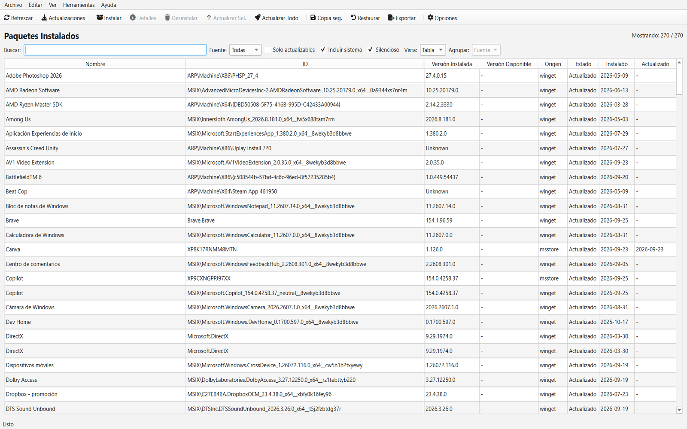
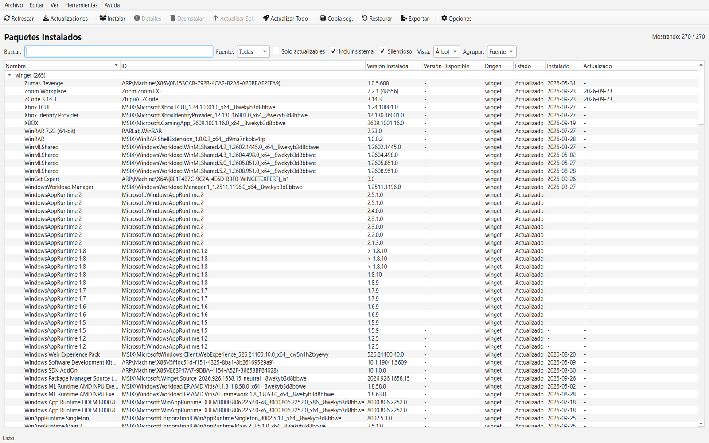
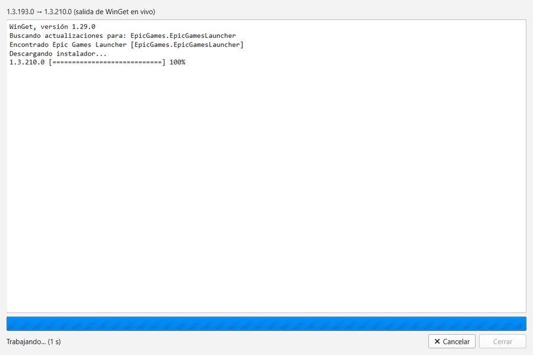
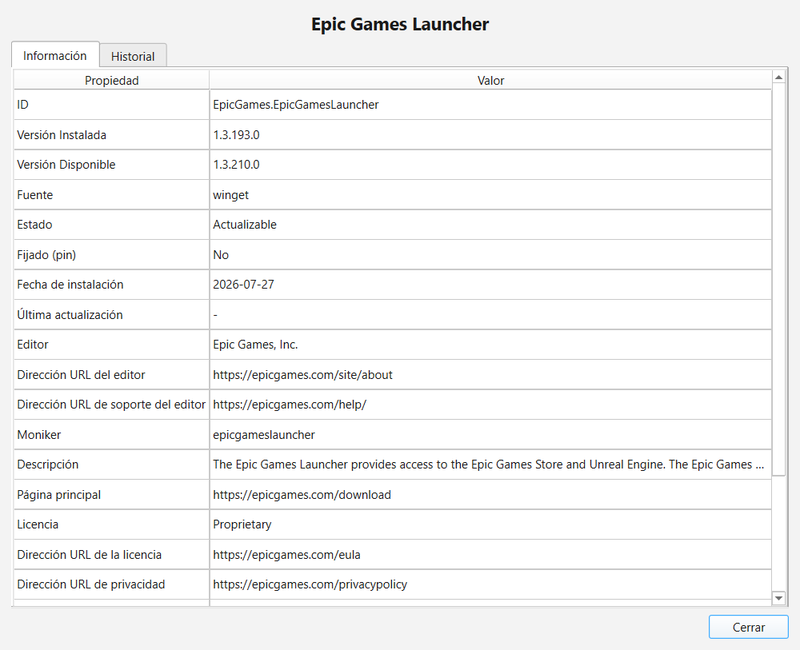

# WinGet Expert

Interfaz gráfica profesional para **Windows Package Manager (WinGet)**: instala,
actualiza y desinstala aplicaciones de Windows sin tocar la terminal.

## Capturas

| Lista de paquetes | Vista de árbol |
|---|---|
|  |  |

| Actualización con log en vivo | Detalles e historial |
|---|---|
|  |  |

## Características

- **Gestión completa**: instalar, actualizar (individual o masiva) y desinstalar.
- **Vista tabla y árbol**, con agrupación por fuente o estado.
- **Fechas de instalación y última actualización** (registro de Windows + historial).
- **Modo silencioso** (`--silent`) conmutable y persistente.
- **Log en vivo** de cada operación larga, con botón **Cancelar**.
- **Pines reales de WinGet** (bloquean actualizaciones incluso por CLI).
- **Copias de seguridad** en JSON, restauración asistida y exportación a **CSV/JSON/TXT**.
- **Gestión de fuentes** de paquetes y limpieza de temporales.
- Interfaz **íntegramente en español**, tema claro/oscuro, filtros,
  manual integrado (F1) y atajos de teclado.

## Descarga

Dos formas de instalar, elige la que prefieras:

- **Instalador** (recomendado):
  **[WinGet_Expert_Instalador.exe](https://github.com/mikear/Winget-Expert/raw/main/dist/WinGet_Expert_Instalador.exe)**
  (~47 MB, asistente en español: accesos directos, menú Inicio y
  desinstalación desde "Aplicaciones instaladas").
- **Portable**:
  **[WinGet_Expert.exe](https://github.com/mikear/Winget-Expert/raw/main/dist/WinGet_Expert.exe)**
  (~45 MB, sin instalación: no requiere Python, doble clic y listo).

## Requisitos

- Windows 10 (1903+) o Windows 11, 64-bit.
- [WinGet](https://aka.ms/getwinget) instalado (viene con Windows 11 y
  *Instalador de aplicación* de Microsoft Store).
- Python 3.10+ y PySide6 (solo para ejecutar desde código fuente).

## Uso

```powershell
pip install -r requirements.txt
python main.py
```

### Generar los binarios (portable e instalador)

```powershell
pip install pyinstaller
pyinstaller winget_gui.spec
# → dist\WinGet_Expert.exe (portable, no requiere Python)

# Instalador (requiere Inno Setup 6):
& "$env:LOCALAPPDATA\Programs\Inno Setup 6\ISCC.exe" instalador.iss
# → dist\WinGet_Expert_Instalador.exe
```

## Estructura

```
main.py                  # entrada: QApplication, tema, icono, splash
src/core/winget_client.py  # wrapper de winget CLI + parser de tablas
src/core/install_dates.py  # fechas desde registro/Appx (solo lectura)
src/core/models.py         # dataclass Package
src/core/settings.py       # config en %APPDATA%\WinGet GUI Manager
src/ui/main_window.py      # ventana principal (tabla + árbol)
src/ui/dialogs.py          # instalar, detalles, restaurar, operación con log
src/ui/additional_dialogs.py  # filtros, manual de usuario
src/ui/splash.py           # splash de arranque (diseño del banner)
src/ui/app_icon.py         # icono de la app (mismo diseño que el splash)
src/ui/mensajes.py         # diálogos con botones en español
src/ui/theme.py            # temas claro/oscuro
assets/                  # icono + fuente Font Awesome (CC BY 4.0)
docs/                    # banner y capturas
tools/                   # script de regeneración de imágenes del README
instalador.iss           # script Inno Setup del instalador
```

## Notas

- La app muestra exactamente lo que WinGet reporta. Las apps de Microsoft Store
  también se actualizan desde la propia Store: si allí ves actualizaciones que
  aquí no aparecen, instálalas desde la Store sin problema.
- Los IDs `MSIX\...` / `ARP\...` son entradas locales (no están en el catálogo):
  se muestran con datos locales y no se pueden fijar.

## Licencia

MIT — ver [LICENSE](LICENSE).

Desarrollado por **Diego A. Rábalo** ·
[LinkedIn](https://linkedin.com/in/rabalo) ·
[GitHub](https://github.com/mikear)
